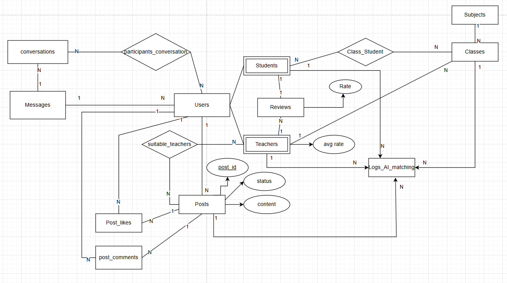

# EduConnect

EduConnect is a web application designed to connect teachers and students, facilitating learning and teaching. The frontend is built using **HTML**, **CSS**, and **JavaScript**, while the backend is developed in **Python** with **PostgreSQL** for data storage. The project uses **Poetry** for dependency management.

## System Requirements

- **Operating System**: Windows, macOS, or Linux.
- **Python**: Version 3.11 or higher (but not Python 4.x).
- **PostgreSQL**: Installed and running on your machine (used for data storage).
- **Poetry**: Dependency management tool (installation instructions below).
- **Git**: To clone the project from GitHub.
- **Node.js** (optional): If you need to use a local development server for the frontend (e.g., with `live-server`).
- **Web Browser**: A modern browser (e.g., Chrome, Firefox) to view the HTML pages.

## Installation

### Step 1: Install Poetry
Poetry is used to manage Python dependencies and the virtual environment for the backend. If you don't have Poetry installed, follow these steps:

1. Open a terminal (PowerShell on Windows, or Terminal on macOS/Linux).
2. Install Poetry:
   - On Windows (PowerShell):
     ```powershell
     (Invoke-WebRequest -Uri https://install.python-poetry.org -UseBasicParsing).Content | python -
     ```
   - On macOS/Linux:
     ```bash
     curl -sSL https://install.python-poetry.org | python3 -
     ```
3. Verify the installation:
   ```powershell
   poetry --version
   ```
   You should see the Poetry version (e.g., `Poetry version 1.8.3`).

### Step 2: Clone the Project from GitHub
1. Clone the repository:
   ```powershell
   git clone https://github.com/ChauTr1102/EduConnect.git
   cd EduConnect
   ```

### Step 3: Install Python Dependencies
The backend uses Python with dependencies managed by Poetry. Install the required packages with the following command:
```powershell
poetry install
```
- This command will:
  - Create a virtual environment for the project.
  - Install dependencies listed in `pyproject.toml` and `poetry.lock` (e.g., `psycopg2` for PostgreSQL).

### Step 4: Configure PostgreSQL
The project uses PostgreSQL for data storage. You need to set up the database before running the backend.

1. **Install PostgreSQL** (if not already installed):
   - Download and install from: [https://www.postgresql.org/download/](https://www.postgresql.org/download/).
   - On Windows, you can use pgAdmin to manage the database.
   - On macOS/Linux, install via package manager:
     ```bash
     # On Ubuntu
     sudo apt update
     sudo apt install postgresql postgresql-contrib
     ```

2. **Create the Database**:
   - Open a terminal or pgAdmin and create the database:
     ```sql
     CREATE DATABASE educonnect;
     ```
   - Create the database (using the `init.sql` file in the project):
     ```sql
     \i init.sql


3. **Configure Database Connection**:
   - Open the file `api/database/__init__.py` and update the PostgreSQL connection details:
     ```python
     DATABASE = "educonnect"
     HOST = "localhost"
     PORT = 5432
     USER = "your_username"  # Replace with your PostgreSQL username
     PASSWORD = "your_password"  # Replace with your PostgreSQL password
     ```
   - **Note**: Do not push this file to GitHub if it contains sensitive information. Add `api/database/__init__.py` to `.gitignore`:
     ```
     api/database/__init__.py
     ```

4. **Insert Sample Data (Optional)**:
   - Use the `insert_fake_data.sql` file to insert sample data:
     ```sql
     \i insert_fake_data.sql
     ```

### Step 5: Run the Backend
The backend is implemented in Python and handles database interactions. The main backend file is `api/main.py` (if it serves as an API) or `api/database.py` (for database testing).

1. Run the backend (e.g., `api/main.py` if it’s an API server):
   ```powershell
   poetry run python api/main.py
   ```
   - If `main.py` is not set up as a server, you can test the database connection with `api/database.py`:
     ```powershell
     poetry run python api/database.py
     ```

2. **Run Using the "Run" Button in VS Code (Optional)**:
   If you prefer to run the backend directly using the "Run" button in VS Code:
   - Open VS Code and open the `api/main.py` or `api/database.py` file.
   - Click on the Python version in the bottom-left corner and select the Poetry virtual environment:
     - Find the virtual environment path:
       ```powershell
       poetry env info --path
       ```
       Example: `C:\Users\<Your_Username>\AppData\Local\pypoetry\virtualenvs\educonnect-py3.11`.
     - Select the Python interpreter:
       ```
       C:\Users\<Your_Username>\AppData\Local\pypoetry\virtualenvs\educonnect-py3.11\Scripts\python.exe
       ```
   - Create a `.vscode/launch.json` file:
     ```json
     {
         "version": "0.2.0",
         "configurations": [
             {
                 "name": "Python: Current File",
                 "type": "python",
                 "request": "launch",
                 "program": "${file}",
                 "console": "integratedTerminal",
                 "justMyCode": true
             }
         ]
     }
     ```
   - Click the "Run" button (green triangle) to start the backend.

### Step 6: Serve the Frontend
The frontend consists of HTML, CSS, and JavaScript files (e.g., `teacher_or_student.html`, `login.html`, etc.). You can serve these files in several ways:

#### Option 1: Open HTML Files Directly in a Browser
1. Navigate to the project directory and locate the HTML file you want to view (e.g., `teacher_or_student.html`).
2. Right-click the file and select "Open with" > your preferred browser (e.g., Chrome, Firefox).
   - **Note**: This method works for static HTML files but may not support dynamic features if the HTML files rely on a backend server for API calls.

#### Option 2: Use a Local Development Server
To properly test the frontend with JavaScript and potential API calls to the backend, use a local development server.

1. **Install `live-server`** (a simple development server for static files):
   - Ensure you have Node.js installed: [https://nodejs.org/](https://nodejs.org/).
   - Install `live-server` globally:
     ```powershell
     npm install -g live-server
     ```
2. Start the server:
   ```powershell
   live-server
   ```
   - This will open your default browser and serve the project on `http://localhost:8080`.
   - By default, `live-server` will load `index.html`. If you want to start with a specific file (e.g., `teacher_or_student.html`), access it directly in the browser: `http://localhost:8080/teacher_or_student.html`.

3. **Connect Frontend to Backend**:
   - If your JavaScript files (e.g., in `teacher_or_student.html`) make API calls to the backend (e.g., `api/main.py`), ensure the backend is running (from Step 5).
   - Update the API endpoints in your JavaScript code to point to the backend server (e.g., `http://localhost:8000` if your backend runs on port 8000).

## Project Structure

```
EduConnect/
├── .idea/                   # IDE configuration (can be ignored)
├── EduconnectGPT/           # Folder for demo version (if applicable)
├── api/                     # Backend-related files
│   ├── database.py          # Handles database connection and queries
│   ├── main.py             # Main backend file (e.g., API server)
│   ├── routes/             # API routes
│   │   ├── __init__.py
│   │   ├── services/
│   │   │   ├── config.py
│   │   │   └── images/
│   │   ├── __init__.py
│   │   └── home.html
│   └── config.py
├── images/                  # Image assets
├── .venv/                   # Virtual environment (if configured to be in-project)
├── chat.html                # HTML for chat interface
├── educonnectGPT.html       # HTML for EduConnectGPT interface
├── home.html                # HTML for home page
├── init.sql                 # SQL file to create tables
├── insert_fake_data.sql     # SQL file to insert sample data
├── login.html               # HTML for login page
├── main.py                  # Main Python file (if applicable)
├── match.html               # HTML for matching interface
├── notification.html        # HTML for notifications
├── pricing.html             # HTML for pricing page
├── profile.html             # HTML for user profile
├── pyproject.toml           # Poetry configuration file
├── poetry.lock              # Dependency lock file
├── quiz.html                # HTML for quiz interface
├── ranking.html             # HTML for ranking page
├── review.html              # HTML for review page
├── schedule.html            # HTML for schedule page
├── setting.html             # HTML for settings page
├── summarization.html       # HTML for summarization feature
├── support.html             # HTML for support page
├── teacher_or_student.html  # HTML for teacher/student selection
├── test.html                # HTML for testing
├── test_database.py         # Python file for testing database
└── welcome.html             # HTML for welcome page
```

## Notes

- **Database Security**: Do not push `api/database/__init__.py` to GitHub if it contains sensitive information (e.g., username, password). Add it to `.gitignore`:
  ```
  api/database/__init__.py
  ```
- **Python Version**: The project requires Python 3.11. Verify your Python version:
  ```powershell
  python --version
  ```
- **Update Dependencies**: If you add new Python packages, run:
  ```powershell
  poetry add <package>
  poetry lock
  ```
  Then push `pyproject.toml` and `poetry.lock` to GitHub.
- **Frontend-Backend Integration**: Ensure the backend server is running and the API endpoints in your JavaScript code match the backend URL (e.g., `http://localhost:8000`).
- **Common Issues**:
  - If you encounter a `ModuleNotFoundError` in the backend, check if the package is installed:
    ```powershell
    poetry run pip list
    ```
  - If you face database connection issues, verify the details in `api/database/__init__.py` and ensure PostgreSQL is running.
  - If JavaScript API calls fail, check the browser's console for errors (e.g., CORS issues) and ensure the backend is accessible.

## Contributing

1. Fork the repository.
2. Create a new branch:
   ```powershell
   git checkout -b feature/<feature-name>
   ```
3. Commit your changes:
   ```powershell
   git commit -m "Add feature <feature-name>"
   ```
4. Push to GitHub:
   ```powershell
   git push origin feature/<feature-name>
   ```
5. Create a Pull Request.

## Contact

For questions or support, reach out via email: `ChauTr1102@example.com`.

---

**EduConnect Team**
